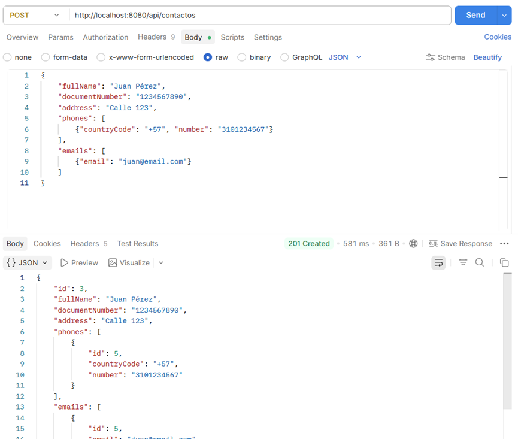
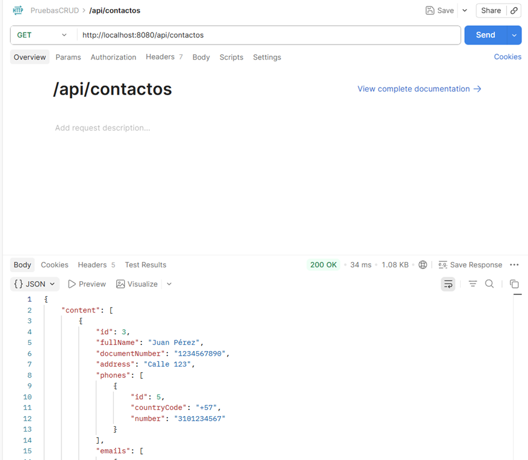
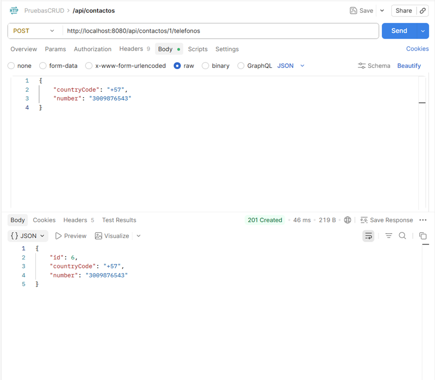
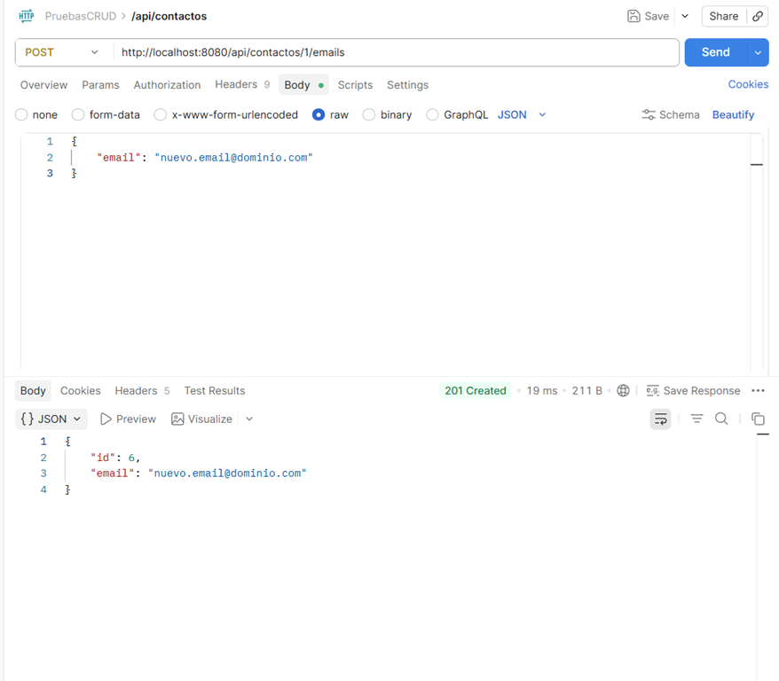
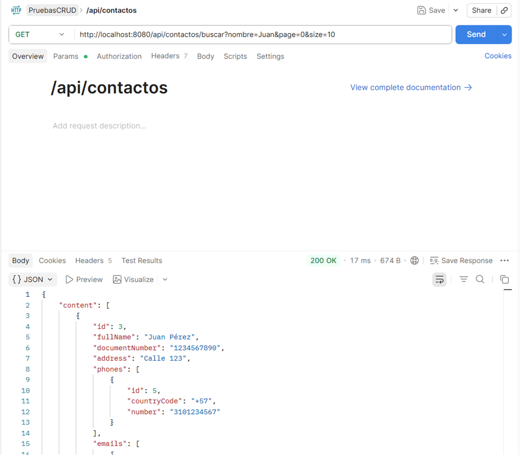
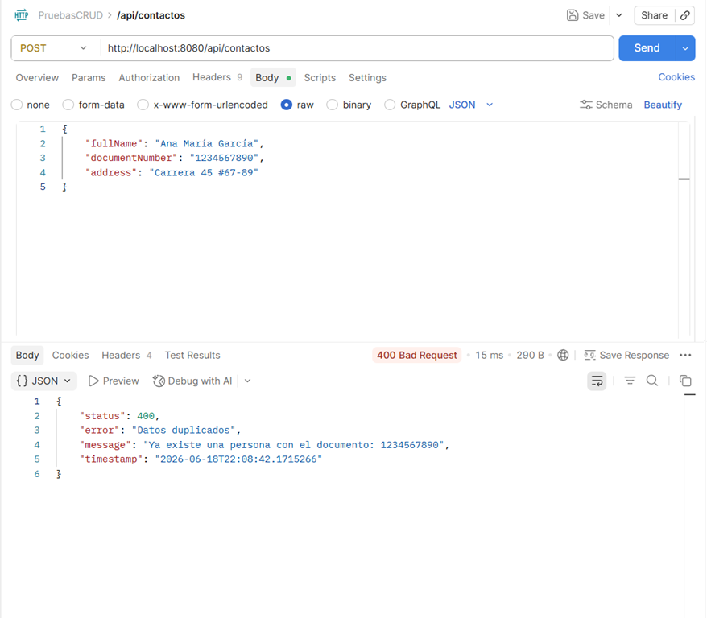

# 📇 Agenda Personal - Prueba Técnica OATI

[](https://adoptium.net/)
[](https://spring.io/projects/spring-boot)
[](https://www.postgresql.org/)
[](https://maven.apache.org/)
[](LICENSE)

---

## 📋 Descripción

API REST para la gestión de una **agenda personal**, desarrollada como parte de la prueba técnica para el proceso de selección de la **Oficina Asesora de Tecnologías e Información (OATI)** de la **Universidad Distrital Francisco José de Caldas**.

La solución permite modelar una agenda de contactos donde cada persona puede registrar:
- ✅ Múltiples números telefónicos
- ✅ Múltiples direcciones de correo electrónico
- ✅ Información personal (nombre, documento, dirección)

---

## 🎯 Alcance Implementado

Durante el desarrollo se abordaron los siguientes aspectos solicitados en el enunciado del ejercicio #5:

| Requisito | Estado |
|-----------|--------|
| Control de versiones con Git/GitHub | ✅ Implementado |
| Modelo de datos relacional | ✅ Implementado |
| Persistencia con PostgreSQL | ✅ Implementado |
| Spring Boot + Spring Data JPA | ✅ Implementado |
| Separación por capas (MVC) | ✅ Implementado |
| Relaciones 1:N (Persona ↔ Teléfonos/Emails) | ✅ Implementado |
| API REST con operaciones CRUD | ✅ Implementado |
| Manejo de excepciones | ✅ Implementado |
| Validación de datos | ✅ Implementado |
| DTOs para separación de capas | ✅ Implementado |
| Paginación y ordenamiento | ✅ Implementado |
| Documentación en código | ✅ Implementado |

## 🛠️ Stack Tecnológico

| Tecnología | Versión | Propósito |
|------------|---------|-----------|
| **Java** | 17 | Lenguaje de programación |
| **Spring Boot** | 3.2.0 | Framework principal |
| **Spring Data JPA** | - | ORM y persistencia |
| **Spring Web** | - | API REST |
| **Spring Validation** | - | Validación de datos |
| **PostgreSQL** | 17 | Base de datos relacional |
| **Hibernate** | 6.2+ | ORM (JPA) |
| **Lombok** | 1.18.30 | Reducción de código boilerplate |
| **Maven** | 3.8+ | Gestor de dependencias |
| **Git** | - | Control de versiones |

---

## 📁 Estructura del Proyecto
```markdown
src/main/java/co/edu/udistrital/agendapersonal/
│
├── AgendaPersonalApplication.java # Clase principal de Spring Boot
│
├── controller/ # Capa de presentación (REST API)
│ ├── PersonalDataController.java # Endpoints de contactos
│ ├── PhoneNumberController.java <div id=""></div> Endpoints anidados de teléfonos
│ └── EmailAddressController.java # Endpoints anidados de emails
│
├── dto/ # Data Transfer Objects
│ ├── request/ # DTOs de entrada
│ │ ├── ContactRequestDTO.java
│ │ ├── PhoneRequestDTO.java
│ │ └── EmailRequestDTO.java
│ └── response/ # DTOs de salida
│ ├── ContactResponseDTO.java
│ ├── PhoneResponseDTO.java
│ └── EmailResponseDTO.java
│
├── entity/ # Entidades JPA
│ ├── PersonalData.java # Tabla: personal_data
│ ├── PhoneNumber.java # Tabla: phone_number
│ └── EmailAddress.java # Tabla: email_address
│
├── exception/ # Manejo de errores
│ ├── ApiErrorResponse.java # Estructura de respuesta de error
│ ├── DuplicateDocumentException.java # Excepción: documento duplicado
│ ├── GlobalExceptionHandler.java # Manejador global de excepciones
│ └── ResourceNotFoundException.java # Excepción: recurso no encontrado
│
├── mapper/ # Conversores DTO ↔ Entidad
│ └── ContactMapper.java # Mapeo de contactos
│
├── repository/ # Capa de acceso a datos
│ ├── PersonalDataRepository.java
│ ├── PhoneNumberRepository.java
│ └── EmailAddressRepository.java
│
└── service/ # Capa de lógica de negocio
├── PersonalDataService.java
├── PhoneNumberService.java
└── EmailAddressService.java
````

## 🗄️ Modelo de Datos

### Diagrama de Entidad-Relación

El modelo de datos se encuentra disponible en:  
`docs/modelo-datos.png`

### Detalles de las Tablas

**📋 Tabla: `personal_data`**

| Campo | Tipo | Restricción | Descripción |
|-------|------|-------------|-------------|
| `id` | BIGINT | PK, Auto-increment | Identificador único |
| `full_name` | VARCHAR(200) | NOT NULL | Nombre completo del contacto |
| `document_number` | VARCHAR(20) | NOT NULL, UNIQUE | Número de documento (identificador único) |
| `address` | VARCHAR(300) | NOT NULL | Dirección del contacto |

**📱 Tabla: `phone_number`**

| Campo | Tipo | Restricción | Descripción |
|-------|------|-------------|-------------|
| `id` | BIGINT | PK, Auto-increment | Identificador único |
| `country_code` | VARCHAR(5) | NOT NULL | Código de país (ej: +57) |
| `number` | VARCHAR(20) | NOT NULL | Número telefónico |
| `personal_data_id` | BIGINT | NOT NULL, FK | Referencia al contacto |

**✉️ Tabla: `email_address`**

| Campo | Tipo | Restricción | Descripción |
|-------|------|-------------|-------------|
| `id` | BIGINT | PK, Auto-increment | Identificador único |
| `email` | VARCHAR(255) | NOT NULL | Correo electrónico |
| `personal_data_id` | BIGINT | NOT NULL, FK | Referencia al contacto |

**Relaciones:**
- `personal_data` (1) ↔ `phone_number` (N): Un contacto puede tener múltiples teléfonos.
- `personal_data` (1) ↔ `email_address` (N): Un contacto puede tener múltiples correos electrónicos.
## 🚀 Instrucciones de Ejecución

### 📋 Requisitos Previos

- ✅ **Java 17** o superior
- ✅ **PostgreSQL 14** o superior
- ✅ **Maven 3.8** o superior
- ✅ **Git** (opcional, para clonar el repositorio)

---

### 🔧 Paso 1: Clonar el Repositorio

```bash
git clone https://github.com/tu-usuario/agenda-personal.git
cd agenda-personal
```
----

### 🗄️ Paso 2: Configurar la Base de Datos

2.1 Crear la base de datos en PostgreSQL:
```sql
CREATE DATABASE agenda_personal;
```

----

### 2.2 Configurar las credenciales en application.properties:

``` properties
# src/main/resources/application.properties

# Configuración de PostgreSQL
spring.datasource.url=jdbc:postgresql://localhost:5432/agenda_personal
spring.datasource.username=postgres
spring.datasource.password=tu_contraseña

# Configuración de JPA/Hibernate
spring.jpa.hibernate.ddl-auto=update
spring.jpa.show-sql=true
spring.jpa.properties.hibernate.dialect=org.hibernate.dialect.PostgreSQLDialect
spring.jpa.properties.hibernate.format_sql=true

# Configuración de Logging
logging.level.co.edu.udistrital.agendapersonal=DEBUG
```
-----

### 🏗️ Paso 3: Compilar y Ejecutar

3.1 Compilar el proyecto:
```bash
mvn clean compile
```
3.2 Ejecutar la aplicación:
```bash
mvn spring-boot:run
```
--------------

### ✅ Paso 4: Verificar que funciona

La API estará disponible en: http://localhost:8080


---

## **PARTE 5: Endpoints de la API**

```markdown
## 📌 Endpoints de la API

### 📇 Contactos

| Método | Endpoint | Descripción | Códigos de Respuesta |
|--------|----------|-------------|---------------------|
| **GET** | `/api/contactos` | Listar contactos (paginado) | 200 OK |
| **GET** | `/api/contactos/all` | Listar todos los contactos | 200 OK |
| **GET** | `/api/contactos/{id}` | Obtener contacto por ID | 200 OK, 404 Not Found |
| **GET** | `/api/contactos/documento/{doc}` | Buscar por documento | 200 OK, 404 Not Found |
| **GET** | `/api/contactos/buscar?nombre=` | Buscar contactos por nombre | 200 OK |
| **POST** | `/api/contactos` | Crear un contacto | 201 Created, 400 Bad Request, 409 Conflict |
| **PUT** | `/api/contactos/{id}` | Actualizar un contacto | 200 OK, 400 Bad Request, 404 Not Found |
| **DELETE** | `/api/contactos/{id}` | Eliminar un contacto | 204 No Content, 404 Not Found |

### 📱 Teléfonos

| Método | Endpoint | Descripción | Códigos de Respuesta |
|--------|----------|-------------|---------------------|
| **GET** | `/api/contactos/{id}/telefonos` | Listar teléfonos de un contacto | 200 OK, 404 Not Found |
| **POST** | `/api/contactos/{id}/telefonos` | Agregar teléfono a un contacto | 201 Created, 400 Bad Request, 404 Not Found |
| **PUT** | `/api/contactos/{id}/telefonos/{telId}` | Actualizar un teléfono | 200 OK, 400 Bad Request, 404 Not Found |
| **DELETE** | `/api/contactos/{id}/telefonos/{telId}` | Eliminar un teléfono | 204 No Content, 404 Not Found |

### ✉️ Emails

| Método | Endpoint | Descripción | Códigos de Respuesta |
|--------|----------|-------------|---------------------|
| **GET** | `/api/contactos/{id}/emails` | Listar emails de un contacto | 200 OK, 404 Not Found |
| **POST** | `/api/contactos/{id}/emails` | Agregar email a un contacto | 201 Created, 400 Bad Request, 404 Not Found |
| **PUT** | `/api/contactos/{id}/emails/{emailId}` | Actualizar un email | 200 OK, 400 Bad Request, 404 Not Found |
| **DELETE** | `/api/contactos/{id}/emails/{emailId}` | Eliminar un email | 204 No Content, 404 Not Found |
````
----
### **PARTE 6: Ejemplos de Peticiones**

````markdown
## 📝 Ejemplos de Peticiones

### ➕ Crear un Contacto

**Petición:**
```http
POST /api/contactos
Content-Type: application/json

{
    "fullName": "Juan Carlos Pérez Gómez",
    "documentNumber": "1234567890",
    "address": "Calle 123 #45-67, Bogotá, Colombia",
    "phones": [
        { 
            "countryCode": "+57", 
            "number": "3101234567" 
        },
        { 
            "countryCode": "+57", 
            "number": "3207654321" 
        }
    ],
    "emails": [
        { 
            "email": "juan.perez@email.com" 
        },
        { 
            "email": "juan.perez@empresa.com" 
        }
    ]
}
````
------
### Respuesta (201 Created):

```json
{
    "id": 1,
    "fullName": "Juan Carlos Pérez Gómez",
    "documentNumber": "1234567890",
    "address": "Calle 123 #45-67, Bogotá, Colombia",
    "phones": [
        { 
            "id": 1, 
            "countryCode": "+57", 
            "number": "3101234567" 
        },
        { 
            "id": 2, 
            "countryCode": "+57", 
            "number": "3207654321" 
        }
    ],
    "emails": [
        { 
            "id": 1, 
            "email": "juan.perez@email.com" 
        },
        { 
            "id": 2, 
            "email": "juan.perez@empresa.com" 
        }
    ]
}
```

------------

### 📋 Listar Contactos (Paginado)

Petición:

```http request
GET /api/contactos?page=0&size=5&sort=fullName,asc
```

### Respuesta (200 OK):

````json
{
    "content": [
        {
            "id": 1,
            "fullName": "Ana María García",
            "documentNumber": "9876543210",
            "address": "Carrera 45 #67-89",
            "phones": [],
            "emails": []
        },
        {
            "id": 2,
            "fullName": "Juan Carlos Pérez",
            "documentNumber": "1234567890",
            "address": "Calle 123 #45-67",
            "phones": [],
            "emails": []
        }
    ],
    "pageable": {
        "pageNumber": 0,
        "pageSize": 5,
        "sort": {
            "sorted": true,
            "unsorted": false,
            "empty": false
        }
    },
    "totalPages": 10,
    "totalElements": 42,
    "last": false,
    "first": true,
    "size": 5,
    "number": 0,
    "empty": false
}
````
------

### 📱 Agregar Teléfono a un Contacto

Petición:

```http request
POST /api/contactos/1/telefonos
Content-Type: application/json

{
    "countryCode": "+57",
    "number": "3009876543"
}
```
### Respuesta (201 Created):

```json
{
    "id": 3,
    "countryCode": "+57",
    "number": "3009876543"
}
```
----------
### ✉️ Agregar Email a un Contacto

Petición:

```http request
POST /api/contactos/1/emails
Content-Type: application/json

{
    "email": "nuevo.email@dominio.com"
}
```
### Respuesta (201 Created):

```json
{
    "id": 3,
    "email": "nuevo.email@dominio.com"
}
```
---------
### 🔍 Buscar Contactos por Nombre

Petición:

```http request
GET /api/contactos/buscar?nombre=Juan&page=0&size=10
```

### Respuesta (200 OK):

```json
{
    "content": [
        {
            "id": 2,
            "fullName": "Juan Carlos Pérez",
            "documentNumber": "1234567890",
            "address": "Calle 123 #45-67",
            "phones": [],
            "emails": []
        },
        {
            "id": 5,
            "fullName": "Juan Pablo Martínez",
            "documentNumber": "5678901234",
            "address": "Avenida 80 #90-12",
            "phones": [],
            "emails": []
        }
    ],
    "pageable": {
        "pageNumber": 0,
        "pageSize": 10
    },
    "totalElements": 2,
    "totalPages": 1
}
```

---

## **PARTE 7: Manejo de Errores**

```markdown
## ⚠️ Manejo de Errores

### ❌ Documento Duplicado (409 Conflict)

**Petición:**
```http
POST /api/contactos
Content-Type: application/json

{
    "fullName": "Ana María García",
    "documentNumber": "1234567890",
    "address": "Carrera 45 #67-89"
}
````
### Respuesta:

```json
{
    "status": 409,
    "error": "Datos duplicados",
    "message": "Ya existe una persona con el documento: 1234567890",
    "timestamp": "2026-06-18T21:30:45.123"
}
```
---------
### ❌ Contacto No Encontrado (404 Not Found)

Petición:

```http request
GET /api/contactos/999
```
### Respuesta:

```json
{
    "status": 404,
    "error": "Recurso no encontrado",
    "message": "Persona no encontrada con ID: 999",
    "timestamp": "2026-06-18T21:31:20.456"
}
```
-----

### ❌ Datos Inválidos (400 Bad Request)

Petición:

```http request
POST /api/contactos
Content-Type: application/json

{
    "fullName": "",
    "documentNumber": "123",
    "address": "Calle 123"
}
```
### Respuesta:

```json
{
    "fullName": "El nombre completo es obligatorio",
    "documentNumber": "El número de documento es obligatorio"
}
```
------

---

## **PARTE 8: Evidencias, Estructura y Final**

```markdown
## 📸 Evidencias de Funcionamiento
````
### 🖥️ Creación de Contacto


### 📋 Listado de Contactos


### 📱 Agregar Teléfono


### ✉️ Agregar Email


### 🔍 Búsqueda por Nombre


### ⚠️ Error - Documento Duplicado


---

## 📁 Estructura del Repositorio

````markdown
agenda-personal/
│
├── docs/
│ ├── modelo-datos.png # Diagrama del modelo de datos
│ ├── evidencia-tablas.png # Evidencia de creación de tablas
│ └── screenshots/ # Capturas de funcionamiento
│ ├── crear-contacto.png
│ ├── listar-contactos.png
│ ├── agregar-telefono.png
│ ├── agregar-email.png
│ ├── buscar-contactos.png
│ └── error-duplicado.png
│
├── src/
│ └── main/
│ ├── java/
│ │ └── co/edu/udistrital/agendapersonal/
│ │ ├── controller/
│ │ ├── dto/
│ │ ├── entity/
│ │ ├── exception/
│ │ ├── mapper/
│ │ ├── repository/
│ │ └── service/
│ └── resources/
│ └── application.properties
│
├── .gitignore
├── pom.xml
└── README.md
````

---

## 👨‍💻 Autor

Desarrollado por **Miguel Angel Babativa Niño**  
📧 Correo: mababativan@udistrital.edu.co  
🐙 GitHub: [github.com/mabn1](https://github.com/mabn1)

---

## 📄 Licencia

Este proyecto está bajo la licencia **MIT** - ver el archivo [LICENSE](LICENSE) para más detalles.

---

## 🙏 Agradecimientos

- **Universidad Distrital Francisco José de Caldas**
- **Oficina Asesora de Tecnologías e Información (OATI)**

---

📌 **Nota:** Este proyecto fue desarrollado como parte del proceso de selección para el cargo de Desarrollador Tecnólogo en la OATI - UD.